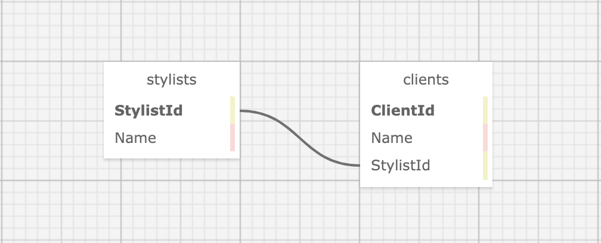

# The Hair Salon

#### _This application will allow a user to track clients and stylist in a Hair Salon_

#### By Erica Marroquin

## Technologies Used

* C#
* .NET 5
* NuGet
* ASP.NET Core
* Entity Framework Core
* MySQL
* MySQL Workbench

## Description

This application will allow a user to keep track of stylists at a salon and their clients. This relationship is one-to-many, where each stylist can have many clients, but each client can only have one stylist. This relationship is shown in the image below.



## Setup/Installation Requirements

* [.NET 5.0](https://dotnet.microsoft.com/download/dotnet/thank-you/sdk-5.0.401-macos-x64-installer) must be installed for this project
* [MySQL](https://dev.mysql.com/downloads/) will be used for this project
  -MacOS must download [MySQL Community Server](https://dev.mysql.com/downloads/mysql/) and [MySQL Workbench](https://dev.mysql.com/downloads/workbench/)
  -Windows can use [MySQL Web Installer](https://dev.mysql.com/downloads/installer/) to download both MySQL Community Server and MySQL Workbench
* Clone this repository to desired location using `git clone` command
* Navigate to HairSalon.Solution/HairSalon
  - Run the command `dotnet restore` to install all necessary packages
* Create a `appsettings.json` files in HairSalon.Solution/HairSalon
  - Open `appsettings.json` and add the following code:
```
  {
  "ConnectionStrings": {
      "DefaultConnection": "Server=localhost;Port=3306;database=hair_salon;uid=[YOUR-USERNAME-HERE];pwd=[YOUR-PASSWORD-HERE];"
  }
}
```
  - Change [YOUR-USERNAME-HERE] and [YOUR-PASSWORD-HERE] to your unique MySQL username and password, respectively
* Launch the MySQL server in your terminal by running the command `mySql -u[YOUR-USERNAME-HERE] -p[YOUR-PASSWORD-HERE]` and changing to your unique MySQL username and password, as above.
* Import the necessary database
  - Open MySQL Workbench
  - Select preferred server
  - Navigate to "Navigator > Administration" and select "Data Import/Restore"
  - In "Import Options" select "Import From Self-Contained File"
  - Navigate to "HairSalon.Solution/erica_marroquin

* To run the application, navigate to BakeryTracker.Solution/BakeryTracker
  - Run the command `dotnet run`
  - If a host does not automatically show in your browser, enter, in your browser, the URL given in the console message when starting `dotnet run` from the previous step.

## Known Bugs

* No know issues

## License

[MIT License](https://opensource.org/licenses/MIT)

## Contact Information

Erica Marroquin | [Email](mailto:ericamarroquin03@gmail.com) | [LinkedIn](https://www.linkedin.com/in/erica-marroquin/)